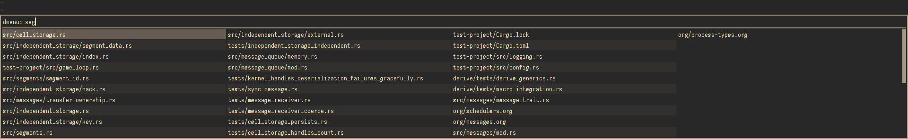

# kak-recent-files
WIP kakoune plugin for managing recent files

This plugin is sort of session management, sort of easy buffer switching. I've written most of the
code in Rust, since that's what I'm most comfortable with.

If you want to use this plugin, file an issue! It's currently fairly specialized to my work flow,
and could use with some good generalization if anyone else is interested in using it.

### Overview

For each session, kak-recent-files keeps a sorted set of files in the current directory, ordered by
most recently used. The "using" here is switching to a kakoune buffer with the file open.

When enabling permenant storage, this set is kept as a newline-delimited list in
`~/.local/share/kak-recent-files/$session_name`. It will be initially populated with all
non-gitignored files in the directory kakoune was first opened in.

When enabling temp storage, this set is kept in a kakoune option for the session. Temp storage also
disables initial population.

When you load `recent-files.kak`, you enable:

- a hook to add files on WinDisplay (any change of what file is displayed)
- the following commands:
  - `krf-open-initial` opens the last file opened with this session
  - `krf-open-menu` opens `rofi` (or configured command) selecting from the recent file set
  - `krf-delete-file` removes a particular file from the set
  - `krf-reset` resets the set of known files

### Recommended Configuration

Since switching buffers is an often used operation when using `kakoune` is an IDE, I recommend
giving `krf-open-menu` it's own keybinding. I personally map the unmodified `'` key to this,
since it's not already used:

```
map -docstring "open buffer" global normal '''' ': krf-open-menu<ret>'
```

I also recommend setting up whether or not krf will use permanent storage on kakoune startup. This
hook sets this based off of whether kakoune is in a named session, or an anonymous one, and then
also runs `krf-open-intial` for named sessions.

```
hook global KakBegin .* -group krf-global-hooks %{
    evaluate-commands %sh{
        if echo "$kak_session" | grep -qE '^[0-9]+$'; then
            echo "set-option global krf_use_temp_storage true"
        else
            echo "set-option global krf_use_temp_storage false"
            echo "krf-open-initial"
        fi
    }
}
```

### Options

- `krf_use_temp_storage`

  true if using temp storage, false if storing on disk

- `krf_menu_command`

  this is the command that will be executed in `krf-open-menu`. the recent file list will be passed
  in via stdin, with the most recent first. the command should output either no lines, or one line
  containing one of the input filenames.

### Menu / Example

This is intended for use with `rofi`, but any command can be set as the `krf_menu_command`.

If you do use rofi, I recommend configuring it further. There's a good guide for configuration at
https://github.com/davatorium/rofi/wiki/themes.

My personal configuration includes the default menu command for this repository,
`rofi -dmenu -i -matching fuzzy`, and the configuration in the file `rofi-config.rasi`. With this
configuration, `kak-recent-files` looks like the following:


